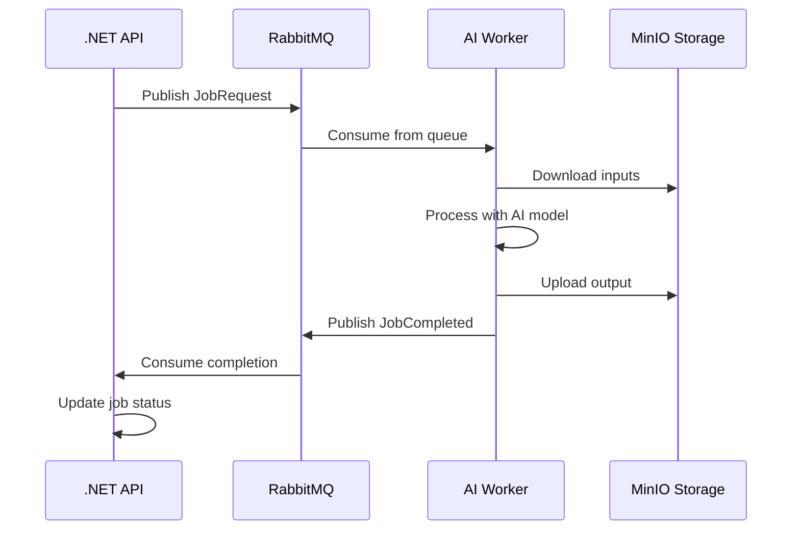

# ADR 004: AI Worker Architecture

## Context
The Trợ Lý KOC platform needs to process 5 types of AI-powered video/image generation jobs:
1. **TalkingHead** - Animate portraits with lip-sync (LivePortrait)
2. **VirtualTryOn** - Virtual clothing try-on (IDM-VTON)
3. **ImageToVideo** - Generate video from still images (SVD-XT)
4. **MotionTransfer** - Transfer motion to images (MimicMotion)
5. **FaceSwap** - Swap faces in videos (FaceFusion)

These models require significant GPU resources and have different optimization characteristics.

## Design Decisions

### 1. Separate Python Worker (Not Embedded in .NET)
**Decision:** Build AI Worker as a separate Python service.

**Reasoning:**
- All 5 AI models are Python-based with PyTorch
- Better GPU memory management in native Python
- Easier to scale AI workers independently
- Can deploy on dedicated GPU instances (RunPod, Lambda Labs)

### 2. Message-Driven Architecture
**Decision:** Use RabbitMQ for job queue communication.

**Reasoning:**
- Decouples API from AI processing
- Natural load balancing across multiple workers
- Built-in retry and dead-letter handling
- Already integrated with .NET via MassTransit

### 3. Lazy Model Loading
**Decision:** Load AI models only when first job of that type arrives.

**Reasoning:**
- Reduces startup time
- Conserves GPU memory (16GB+ required for all models)
- Allows single worker to serve multiple job types
- Models stay loaded after first use for fast subsequent jobs

### 4. Placeholder Mode for Development
**Decision:** Provide placeholder implementations when actual models aren't installed.

**Reasoning:**
- Allows testing full pipeline without GPU
- Developers can work on API/Frontend without AI dependencies
- FFmpeg-based placeholders simulate real output structure

### 5. MinIO for Storage
**Decision:** Use MinIO for input/output file storage.

**Reasoning:**
- S3-compatible API (easy to migrate to AWS S3 later)
- Same storage for both .NET API and Python Worker
- Can store large video files efficiently
- Already in Docker Compose stack

## Worker Flow



## File Structure

```
src/ai-worker/
├── main.py              # Entry point
├── requirements.txt     # Dependencies
├── Dockerfile          # GPU-enabled image
└── worker/
    ├── config.py           # Pydantic settings
    ├── message_consumer.py # RabbitMQ integration
    ├── job_dispatcher.py   # Routes to processors
    ├── storage.py          # MinIO client
    └── processors/
        ├── base.py             # Abstract base
        ├── talking_head.py     # LivePortrait
        ├── virtual_tryon.py    # IDM-VTON
        ├── image_to_video.py   # SVD-XT
        ├── motion_transfer.py  # MimicMotion
        └── face_swap.py        # FaceFusion
```

## GPU Requirements

| Model | Min VRAM | Recommended |
|-------|----------|-------------|
| LivePortrait | 4GB | 8GB |
| IDM-VTON | 8GB | 16GB |
| SVD-XT | 8GB | 16GB |
| MimicMotion | 8GB | 16GB |
| FaceFusion | 4GB | 8GB |
| **All Models** | **16GB** | **24GB** |

## Deployment Options

1. **Local Development**: Run without GPU, use placeholders
2. **Docker Compose**: Uncomment ai-worker service (requires NVIDIA Container Toolkit)
3. **RunPod**: Deploy as serverless GPU function
4. **Self-hosted**: Run on dedicated GPU server

## Status
**Accepted** - Implemented on 2026-01-25
